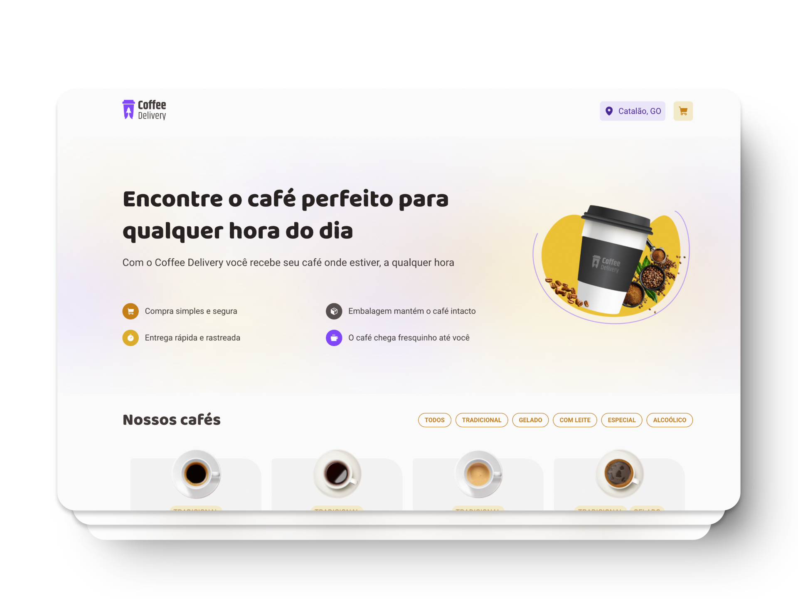

# Grão de Ouro - E-commerce de Café

**Grão de Ouro** é um e-commerce de café gourmet, oferecendo uma experiência simples e prática para que você possa adquirir cafés de qualidade. A aplicação permite adicionar itens ao carrinho, ajustar quantidades e finalizar a compra com facilidade.

🔗 **Experimente agora mesmo:** [graodeouro.vercel.app](https://graodeouro.vercel.app/)

## Tecnologias

<p>
  
  
  
  
  
  
  
  
</p>




## Bibliotecas

- **React**: Biblioteca JavaScript para construção de interfaces de usuário interativas.
- **React Hook Form**: Biblioteca leve e eficiente para manipulação de formulários, com validação integrada e suporte a validações com Zod.
- **Styled Components**: Permite escrever CSS em JavaScript para componentes, facilitando a criação de estilos dinâmicos e modularizados.
- **Immer**: Facilita a manipulação imutável de estados, tornando a gestão de dados mais simples e eficiente.
- **Zod**: Biblioteca para validação e definição de esquemas, garantindo a consistência dos dados.
- **React Router DOM**: Gerencia as rotas da aplicação, permitindo a navegação entre diferentes páginas.
- **Phosphor Icons**: Conjunto de ícones personalizáveis e otimizados para melhorar a interface do usuário.
- **@hookform/resolvers**: Utilizado para integração de validações de formulários com Zod.

## Funcionalidades

- 🛍️ **Catálogo de Cafés**: Explore os produtos disponíveis, com descrições e preços.
- 🛒 **Carrinho de Compras**: Adicione, remova e altere a quantidade de itens no carrinho.
- 💳 **Finalização de Compra**: Realize a finalização do pedido com informações de entrega (simulado).
- 💾 **Persistência de Dados**: O estado do carrinho é salvo no localStorage, garantindo que seus itens permaneçam enquanto você navega pela aplicação.
- 📱 **Responsividade**: Interface responsiva, ideal para visualização em qualquer dispositivo.

## Como usar o projeto

1. Clone o repositório:
    ```bash
    git clone https://github.com/anaclaraaraujo/graodeouro.git
    cd graodeouro
    ```
    
2. Instale as dependências:
    ```bash
    npm install
    ```
    
3. Inicie o servidor de desenvolvimento:
    ```bash
    npm run dev
    ```
    
4. Abra no navegador:
    - Acesse [http://localhost:5173](http://localhost:5173)

## Licença 
[](https://github.com/anaclaraaraujo/graodeouro/blob/main/LICENSE)
